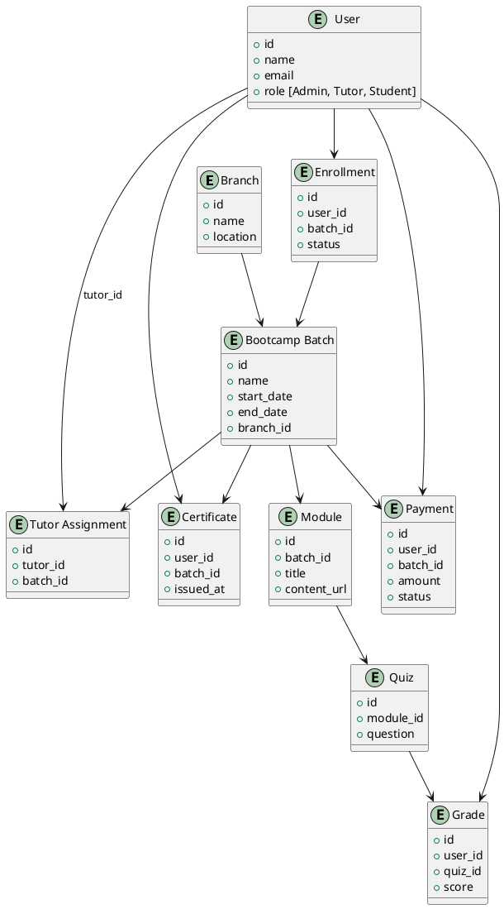

Berikut adalah versi **Markdown lengkap** dari analisa sistem digital pendidikan berbasis **Bootcamp** seperti Ruangguru, menggunakan Laravel dan API.

---

# 🧩 Analisa Sistem Bootcamp Digital (Laravel + API)

## 📌 1. What — Apa yang Dibuat?

Sistem pendidikan digital berbasis **Bootcamp** dengan fitur:

* **Company Profile**
* **HRM System**
* **Bootcamp LMS**
* **Pembayaran Midtrans**
* **Notifikasi WhatsApp & Email**
* **Sertifikat Otomatis**
* **API First Design**

---

## 🧭 2. Why — Mengapa Menggunakan Bootcamp?

* Fokus pada **hasil cepat** dan **terukur**
* Cocok untuk **pembelajaran intensif 3–6 bulan**
* Daya tarik tinggi bagi pencari kerja / fresh graduate
* Sistem lebih **terstruktur dan terukur**

---

## 👤 3. Who — Siapa Pengguna Sistem?

* `Admin Pusat` – Mengelola seluruh sistem
* `Admin HRM` – Mengelola karyawan, tutor, absensi
* `Admin LMS` – Mengelola batch bootcamp, materi, peserta
* `Tutor / Instruktur` – Mengajar sesuai batch
* `Peserta Bootcamp` – Mengikuti pelatihan
* `Branch Manager` – Mengelola cabang (Pusat, Citra, dll)

---

## 🗓️ 4. When — Kapan Digunakan?

* Saat membuka batch bootcamp baru
* Selama proses pembelajaran berlangsung
* Setelah selesai untuk sertifikasi

---

## 🌐 5. Where — Dimana Digunakan?

* Website publik (Landing page + Pendaftaran)
* Admin panel (Manajemen internal)
* API (Untuk Mobile App, Notifikasi, dll)

---

## ⚙️ 6. How — Cara Sistem Bekerja

1. User mendaftar bootcamp (pilih batch & cabang)
2. Admin verifikasi dan alokasikan peserta
3. Tutor mengajar berdasarkan jadwal batch
4. Peserta menyelesaikan modul, quiz, dan tugas
5. Sistem memberikan nilai & terbitkan sertifikat
6. Pembayaran melalui Midtrans
7. Semua aktivitas dapat diakses via API

---

# 🧱 Struktur Bootcamp

| Fitur              | Penjelasan                                               |
| ------------------ | -------------------------------------------------------- |
| **Batch Bootcamp** | Kurikulum intensif 3–6 bulan per cabang                  |
| **Modul & Materi** | Materi per minggu, berbasis video/PDF/tugas              |
| **Quiz & Nilai**   | Penilaian otomatis / manual                              |
| **Sertifikat**     | Otomatis setelah kelulusan                               |
| **Tutor**          | Terdaftar sesuai batch dan cabang                        |
| **Jadwal**         | Rata-rata 2–3 sesi per minggu (total 48–72 sesi/6 bulan) |
| **Pembayaran**     | Flat atau cicilan, terhubung dengan Midtrans             |
| **Notifikasi**     | Email & WhatsApp terintegrasi API                        |

---

# 🧠 SWOT Analysis Bootcamp

| Kategori          | Analisa                                                                 |
| ----------------- | ----------------------------------------------------------------------- |
| **Strengths**     | - Fokus hasil nyata - Kurikulum jelas - Cocok untuk skill upgrade |
| **Weaknesses**    | - Butuh tutor ahli - Manajemen batch & jadwal kompleks               |
| **Opportunities** | - Banyak market - Bisa hybrid offline/online                         |
| **Threats**       | - Kompetitor besar - Ketergantungan pada tutor/konten                |

---

# 🔄 ERD Bootcamp (PlantUML)

---

# ✅ Next Step untuk Tim Dev

1. Buat model Laravel: `User`, `Branch`, `Batch`, `Module`, `Quiz`, `Grade`, `Payment`, `Certificate`
2. Buat API endpoint (Laravel Sanctum / Passport):

   * `/api/enrollments`
   * `/api/batches`
   * `/api/grades`
   * `/api/certificates`
3. Integrasikan Midtrans dan WhatsApp Gateway (qontak, wablas, dll)
4. Siapkan Dashboard Admin (LMS, HRM, Payment)

---

---

### ✅ **1. Struktur Database & Relasi (Laravel Migration)**

Kenapa duluan?

* Ini adalah **fondasi** dari semua fitur.
* Tanpa relasi yang jelas, API dan fitur di atasnya bisa kacau.

**Yang disiapkan:**

* `users` (admin, tutor, student)
* `branches` (cabang pusat/citra)
* `batches` (bootcamp per periode)
* `modules`, `quizzes`, `grades`
* `enrollments`
* `payments`
* `certificates`

---

### ⏭️ Setelah itu:

### ✅ **2. REST API Design (Laravel Resource/API Resource)**

Setelah struktur DB mantap, kita lanjut buat:

* API endpoint: daftar, ikut batch, akses materi, quiz, nilai
* API untuk Admin dan Tutor: input materi, nilai, jadwal

---

### ✅ **3. Midtrans Integration**

* Setup API callback (webhook)
* Tagihan otomatis berdasarkan batch
* Konfirmasi pembayaran

---

### ✅ **4. WhatsApp + Email Notification**

* Pengingat jadwal
* Status pembayaran
* Sertifikat berhasil terbit

---

> **Rekomendasi: Mulai dari Database dulu.**
> Kalau kamu setuju, saya bisa langsung bantu buatkan skema migrasi Laravel-nya.
